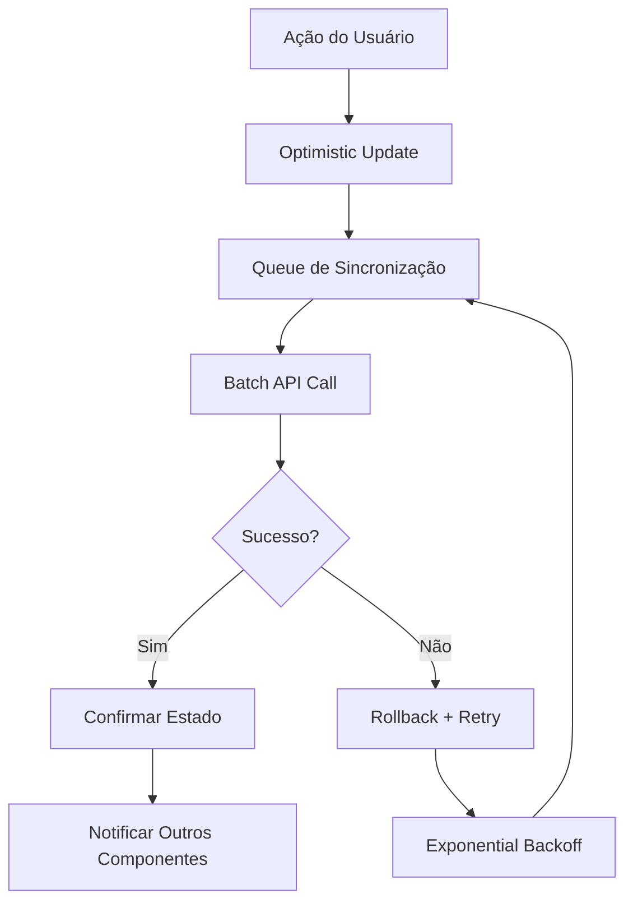

# Especificação Técnica: Melhoria do Sistema Kanban

## 1. Análise dos Problemas Atuais

### 1.1 Problemas Identificados

#### Sincronização de Estado
- **Estado Local vs Servidor**: O componente mantém estado local (`cards`) que pode divergir do servidor
- **Múltiplas Fontes de Verdade**: localStorage, estado local, contexto global e servidor não estão sincronizados
- **Race Conditions**: Atualizações simultâneas podem causar inconsistências
- **Cache Desatualizado**: Sistema de cache de 5 segundos pode mostrar dados obsoletos

#### Lógica de Drag and Drop
- **Complexidade Excessiva**: Função `handleDragEnd` com mais de 200 linhas
- **Cálculos de Ordem Inconsistentes**: Reordenação manual pode gerar conflitos
- **Validações Inadequadas**: Regras de negócio não são aplicadas consistentemente
- **Performance**: Recálculo desnecessário de todas as posições a cada movimento

#### Experiência do Usuário
- **Feedback Visual Limitado**: Falta de indicadores de sincronização
- **Tratamento de Erros**: Falhas de rede não são tratadas adequadamente
- **Responsividade**: Interface não otimizada para dispositivos móveis
- **Estados de Loading**: Indicadores de carregamento inconsistentes

### 1.2 Impacto nos Usuários
- Perda de dados durante movimentações
- Interface travando em dispositivos móveis
- Inconsistências visuais entre diferentes abas
- Frustração com sincronização lenta

## 2. Arquitetura Técnica Proposta

### 2.1 Estrutura de Dados Otimizada

```typescript
interface KanbanState {
  columns: {
    [key in KanbanColumn]: {
      id: KanbanColumn
      title: string
      taskIds: number[]
      lastUpdated: number
    }
  }
  tasks: {
    [taskId: number]: KanbanTask
  }
  syncStatus: {
    pending: number[]
    syncing: number[]
    failed: number[]
  }
  lastSync: number
}

interface KanbanTask extends Todo {
  column: KanbanColumn
  position: number
  localChanges?: Partial<KanbanTask>
  syncStatus: 'synced' | 'pending' | 'syncing' | 'failed'
}
```

### 2.2 Sistema de Sincronização

#### Fluxo de Sincronização


#### Implementação do Sync Manager
```typescript
class KanbanSyncManager {
  private queue: SyncOperation[] = []
  private retryQueue: SyncOperation[] = []
  private isProcessing = false
  
  async queueOperation(operation: SyncOperation) {
    this.queue.push(operation)
    this.processQueue()
  }
  
  private async processQueue() {
    if (this.isProcessing) return
    this.isProcessing = true
    
    while (this.queue.length > 0) {
      const batch = this.queue.splice(0, 10) // Processar em lotes
      await this.processBatch(batch)
    }
    
    this.isProcessing = false
  }
}
```

### 2.3 Cache Inteligente

```typescript
class KanbanCache {
  private cache = new Map<string, CacheEntry>()
  private readonly TTL = 30000 // 30 segundos
  
  set(key: string, data: any, priority: 'high' | 'medium' | 'low' = 'medium') {
    const ttl = this.getTTLByPriority(priority)
    this.cache.set(key, {
      data,
      timestamp: Date.now(),
      ttl,
      priority
    })
  }
  
  invalidateByPattern(pattern: RegExp) {
    for (const [key] of this.cache) {
      if (pattern.test(key)) {
        this.cache.delete(key)
      }
    }
  }
}
```

## 3. Melhorias Específicas

### 3.1 Sistema de Drag and Drop Simplificado

#### Nova Implementação
```typescript
const handleDragEnd = useCallback((event: DragEndEvent) => {
  const { active, over } = event
  
  if (!over || !active) return
  
  const moveOperation = calculateMoveOperation(active, over, kanbanState)
  
  if (!validateMove(moveOperation)) {
    showMoveError(moveOperation.reason)
    return
  }
  
  // Optimistic update
  dispatch({ type: 'MOVE_TASK_OPTIMISTIC', payload: moveOperation })
  
  // Queue para sincronização
  syncManager.queueOperation({
    type: 'MOVE_TASK',
    taskId: moveOperation.taskId,
    fromColumn: moveOperation.fromColumn,
    toColumn: moveOperation.toColumn,
    position: moveOperation.position
  })
}, [kanbanState, syncManager])
```

### 3.2 Validações de Integridade

```typescript
const validateMove = (operation: MoveOperation): ValidationResult => {
  const rules = [
    validateColumnTransition,
    validateTaskDueDate,
    validateUserPermissions,
    validateBusinessRules
  ]
  
  for (const rule of rules) {
    const result = rule(operation)
    if (!result.valid) {
      return result
    }
  }
  
  return { valid: true }
}
```

### 3.3 Sistema de Notificações Melhorado

```typescript
const NotificationSystem = {
  showSyncStatus: (status: SyncStatus) => {
    switch (status) {
      case 'syncing':
        return toast.loading('Sincronizando...', { id: 'sync' })
      case 'success':
        return toast.success('Sincronizado', { id: 'sync' })
      case 'error':
        return toast.error('Erro na sincronização', { 
          id: 'sync',
          action: { label: 'Tentar novamente', onClick: retry }
        })
    }
  }
}
```

### 3.4 Indicadores Visuais de Sincronização

```typescript
const SyncIndicator = ({ task }: { task: KanbanTask }) => {
  const getIndicator = () => {
    switch (task.syncStatus) {
      case 'pending':
        return <Clock className="h-3 w-3 text-yellow-500" />
      case 'syncing':
        return <Loader2 className="h-3 w-3 text-blue-500 animate-spin" />
      case 'failed':
        return <AlertCircle className="h-3 w-3 text-red-500" />
      default:
        return null
    }
  }
  
  return (
    <div className="absolute top-1 right-1">
      {getIndicator()}
    </div>
  )
}
```

## 4. Funcionalidades Específicas

### 4.1 Drag and Drop Responsivo

#### Configuração para Mobile
```typescript
const sensors = useSensors(
  useSensor(PointerSensor, {
    activationConstraint: {
      distance: isMobile ? 8 : 3,
      delay: isMobile ? 200 : 0
    }
  }),
  useSensor(TouchSensor, {
    activationConstraint: {
      delay: 250,
      tolerance: 5
    }
  })
)
```

#### Interface Adaptativa
```typescript
const KanbanColumn = ({ column, isMobile }: Props) => {
  return (
    <div className={cn(
      "kanban-column",
      isMobile ? "w-[280px] min-w-[280px]" : "w-[320px] min-w-[320px]"
    )}>
      {isMobile ? (
        <MobileColumnHeader column={column} />
      ) : (
        <DesktopColumnHeader column={column} />
      )}
      
      <ScrollArea className={cn(
        "kanban-tasks",
        isMobile ? "h-[calc(100vh-200px)]" : "h-[calc(100vh-180px)]"
      )}>
        {/* Tasks */}
      </ScrollArea>
    </div>
  )
}
```

### 4.2 Sincronização em Tempo Real

#### WebSocket Integration
```typescript
const useRealtimeSync = () => {
  useEffect(() => {
    const ws = new WebSocket(`${WS_URL}/kanban/${userId}`)
    
    ws.onmessage = (event) => {
      const update = JSON.parse(event.data)
      
      switch (update.type) {
        case 'TASK_MOVED':
          dispatch({ type: 'SYNC_TASK_MOVE', payload: update.data })
          break
        case 'TASK_UPDATED':
          dispatch({ type: 'SYNC_TASK_UPDATE', payload: update.data })
          break
      }
    }
    
    return () => ws.close()
  }, [userId])
}
```

### 4.3 Suporte Offline

```typescript
const useOfflineSupport = () => {
  const [isOnline, setIsOnline] = useState(navigator.onLine)
  
  useEffect(() => {
    const handleOnline = () => {
      setIsOnline(true)
      syncManager.processOfflineQueue()
    }
    
    const handleOffline = () => {
      setIsOnline(false)
      toast.info('Modo offline ativado')
    }
    
    window.addEventListener('online', handleOnline)
    window.addEventListener('offline', handleOffline)
    
    return () => {
      window.removeEventListener('online', handleOnline)
      window.removeEventListener('offline', handleOffline)
    }
  }, [])
  
  return { isOnline }
}
```

## 5. Implementação por Fases

### Fase 1: Refatoração da Base (Semana 1-2)
- [ ] Implementar nova estrutura de dados
- [ ] Criar SyncManager básico
- [ ] Simplificar handleDragEnd
- [ ] Adicionar validações básicas

### Fase 2: Melhorias de UX (Semana 3)
- [ ] Implementar indicadores visuais
- [ ] Melhorar sistema de notificações
- [ ] Otimizar para mobile
- [ ] Adicionar estados de loading

### Fase 3: Funcionalidades Avançadas (Semana 4)
- [ ] Implementar sincronização em tempo real
- [ ] Adicionar suporte offline
- [ ] Sistema de retry automático
- [ ] Métricas e monitoramento

### Fase 4: Otimizações (Semana 5)
- [ ] Performance tuning
- [ ] Testes de carga
- [ ] Documentação
- [ ] Treinamento da equipe

## 6. Métricas de Sucesso

### 6.1 Performance
- Tempo de resposta do drag and drop < 100ms
- Sincronização com servidor < 500ms
- Taxa de erro de sincronização < 1%
- Tempo de carregamento inicial < 2s

### 6.2 Experiência do Usuário
- Taxa de abandono da funcionalidade < 5%
- Satisfação do usuário > 4.5/5
- Redução de 80% nos reports de bugs
- Aumento de 30% no uso do Kanban

### 6.3 Técnicas
- Cobertura de testes > 90%
- Tempo de build < 30s
- Bundle size do Kanban < 150KB
- Lighthouse score > 95

## 7. Considerações de Segurança

### 7.1 Validação de Dados
- Validar todas as operações no backend
- Sanitizar dados de entrada
- Implementar rate limiting
- Logs de auditoria para mudanças

### 7.2 Autorização
- Verificar permissões para cada operação
- Validar ownership das tarefas
- Implementar RBAC para projetos
- Session management robusto

## 8. Monitoramento e Observabilidade

### 8.1 Métricas de Aplicação
```typescript
const trackKanbanMetrics = () => {
  // Performance metrics
  performance.mark('kanban-drag-start')
  performance.mark('kanban-drag-end')
  
  // Business metrics
  analytics.track('kanban_task_moved', {
    fromColumn,
    toColumn,
    taskId,
    userId,
    timestamp: Date.now()
  })
  
  // Error tracking
  if (error) {
    Sentry.captureException(error, {
      tags: { component: 'kanban' },
      extra: { operation, taskId }
    })
  }
}
```

### 8.2 Health Checks
- Endpoint de health para API do Kanban
- Monitoramento de WebSocket connections
- Alertas para alta latência
- Dashboard de métricas em tempo real

## 9. Conclusão

Esta especificação técnica fornece um roadmap completo para transformar o sistema Kanban atual em uma solução robusta, performática e confiável. A implementação por fases permite uma migração gradual sem interrupção do serviço, enquanto as métricas definidas garantem que os objetivos sejam alcançados.

O foco em sincronização robusta, experiência do usuário fluida e arquitetura escalável resultará em um Kanban que não apenas funciona perfeitamente, mas também oferece uma base sólida para futuras expansões e melhorias.